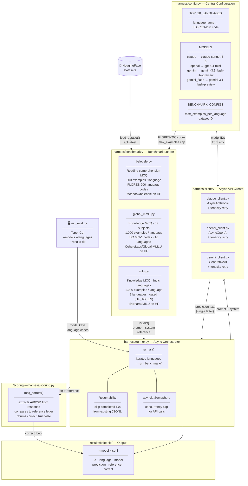

# Evaluation Harness Architecture

## Layer Descriptions

### Entry — `run_eval.py`
Typer CLI. Accepts `--models` and `--languages` flags (both optional — defaults to all three models and all 20 languages), then hands off to `run_all()`.

### Orchestration — `harness/runner.py`
Core async loop. For each language × model:
1. Checks existing JSONL for completed IDs (resumability — safe to interrupt and restart)
2. Fires async API calls behind a concurrency semaphore
3. Scores each prediction immediately after receipt
4. Appends records to per-model JSONL

### Config — `harness/config.py`
Central config for the 20 target languages (name → FLORES-200 code), model IDs (overridable via `.env`), and Belebele dataset settings.

### Benchmark Loaders — `harness/benchmarks/`

**`belebele.py`** — Loads `facebook/belebele`. Each example has a passage, question, and four answer options (A–D). 900 examples per language across all 20 target languages.

**`global_mmlu.py`** — Loads `CohereLabs/Global-MMLU`. Knowledge MCQ covering 57 academic subjects, translated into 42 languages. Covers 16 of the 20 target languages (ISO 639-1 codes). Capped at 1,000 examples per language.

**`milu.py`** — Loads `ai4bharat/MILU` (gated — requires `HF_TOKEN`). Knowledge MCQ focused on Indic languages. Covers 7 of the 20 target languages. Capped at 1,000 examples per language. Options stored as `option1–4`, answer as the key name of the correct option (e.g. `"option2"`).

### API Clients — `harness/clients/`
Three thin async wrappers with an identical interface (`complete(prompt, system, max_tokens, temperature)`). All use `tenacity` for exponential-backoff retry on rate limits and transient errors.

### Scoring — `harness/scoring.py`
Single-pass, fully automated. `mcq_correct()` extracts the first A/B/C/D letter from the model response and compares it to the reference. No judge pass needed.

### Storage — `results/belebele/`
Append-only JSONL. One file per model (`claude.jsonl`, `openai.jsonl`, `gemini.jsonl`). Each record contains the example ID, language code, model key, raw prediction, reference answer, and a boolean `correct` field.
