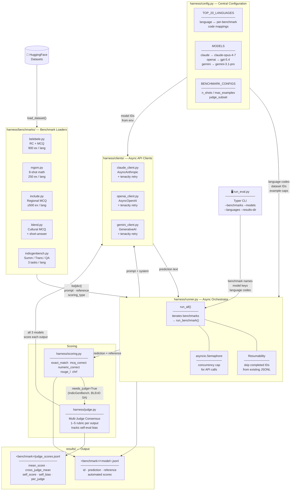

# Evaluation Harness Architecture

## Layer Descriptions

### Entry — `run_eval.py`
Typer CLI. Validates benchmark/model selections, then hands off to `run_all()`. Defaults to the full Tier 1 suite across all three models.

### Orchestration — `harness/runner.py`
Core async loop. For each benchmark × language × model:
1. Checks existing JSONL for completed IDs (resumability)
2. Fires async API calls behind a concurrency semaphore
3. Scores each prediction immediately after receipt
4. Appends records to per-model JSONL
5. Batches `needs_judge` examples and runs the multi-judge pass

### Config — `harness/config.py`
Single source of truth for language code mappings (each benchmark uses a different format: FLORES-200 codes, ISO codes, or language name strings), model IDs (overridable via env), dataset IDs, and per-benchmark settings.

### Benchmark Loaders — `harness/benchmarks/`
Each class implements two methods:
- `load(language_code) → list[dict]` — fetches from HuggingFace, caps examples, builds prompt strings
- `score(prediction, example) → dict` — returns automated metric scores and `needs_judge` flag

### API Clients — `harness/clients/`
Thin async wrappers with identical interfaces (`complete(prompt, system, max_tokens, temperature)`). All three use `tenacity` for exponential-backoff retry on rate limits and transient errors.

### Scoring — `harness/scoring.py` + `harness/judge.py`
Two-pass scoring:
- **Automated** (immediate): exact match for MCQ, numeric extraction for MGSM, ROUGE-L + chrF for generation
- **Multi-judge** (deferred): all three models score each other's generation outputs on a 1–5 rubric; `ConsensusResult` records mean score, cross-judge mean, self-score, and self-bias (self_score − cross_judge_mean)

### Storage — `results/`
Append-only JSONL files. One file per benchmark × model for raw predictions and automated scores; one `judge_scores.jsonl` per benchmark for consensus results.
